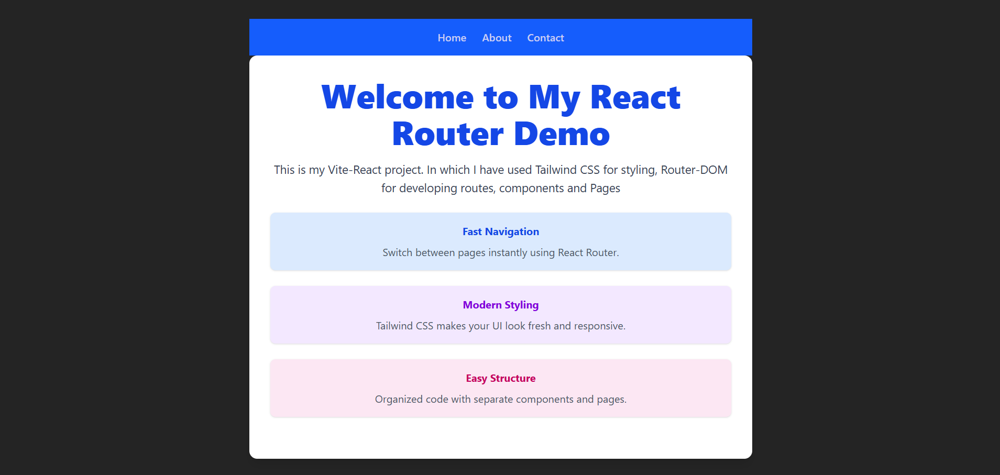
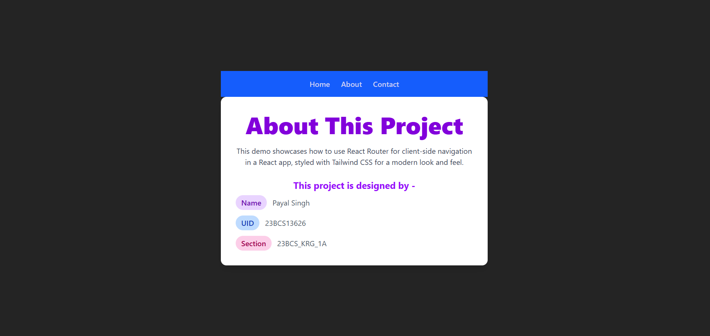
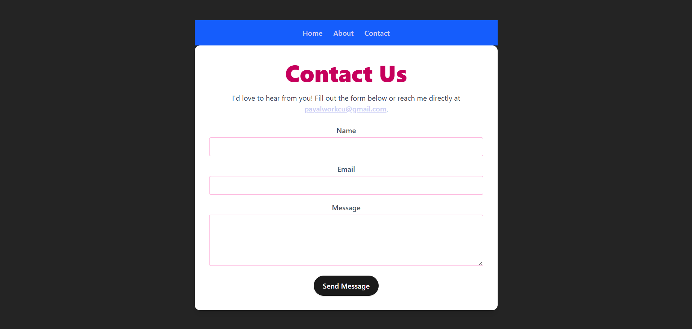

# React Routes Demo

**Author:** Payal Singh  
**UID:** 23BCS13626  
**Section:** 23BCS_KRG1A  

This is a **React application** demonstrating the fundamentals of **React Routes** with **Tailwind CSS**.  
The application includes the following pages:

- **Home Page**  
- **About Page**  
- **Contact Page**

## Screenshots

### Home Page

### About Page

### Contact Page

## Features

- Navigation between pages using **React Router**  
- Styled with **Tailwind CSS**  
- Responsive design  

## Setup

1. Clone the repository  
2. Run `npm install`  
3. Run `npm start`  
4. Open `http://localhost:3000` in your browser

