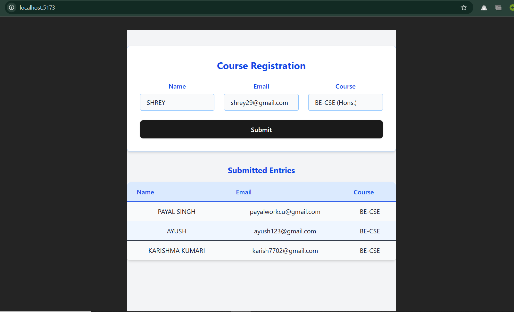

# React Student Form

**Author:** Payal Singh  
**UID:** 23BCS13626  
**Section:** 23BCS_KRG1A  

This is a **React-based form application** that accepts **student entries** and displays them upon submission.  

## Features

- Add student details: Name, Age, Email, etc.  
- Display a list of submitted entries dynamically  
- Form validation included  
- Built using **React**  

## Form Page

## Setup

1. Clone the repository  
2. Run `npm install`  
3. Run `npm start`  
4. Open `http://localhost:3000` in your browser

